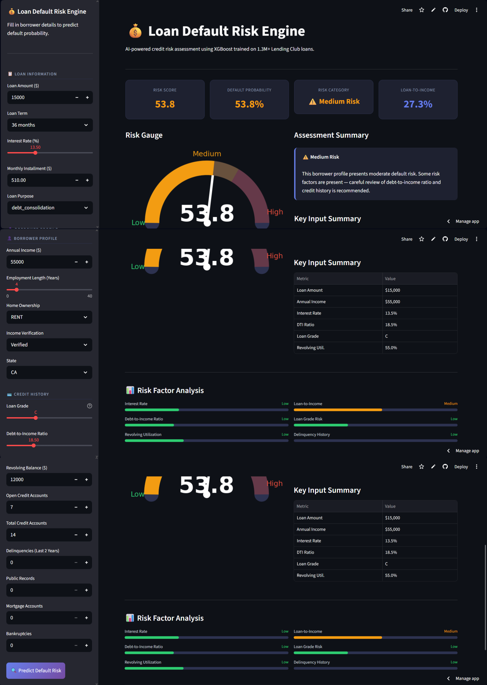

# 💰 Loan Default Risk Prediction & Scoring Engine

> End-to-end credit risk system that predicts borrower default probability and converts it into a business-friendly **0–100 risk score** — trained on 1.3M+ real Lending Club loans.

[](https://loan-default-risk-engine-gxibehstp7sugrrart2cfa.streamlit.app/)


---

## 🚀 Live Demo

👉 **[loan-default-risk-engine-gxibehstp7sugrrart2cfa.streamlit.app](https://loan-default-risk-engine-gxibehstp7sugrrart2cfa.streamlit.app/)**

---

## 📸 App Preview



---

## ✨ What Makes This Different

| Typical credit risk model | This project |
|---|---|
| Binary output only (default / no default) | Probability score + **0–100 risk score** |
| Single model | 3-model comparison (LR, RF, XGBoost) |
| No explainability | SHAP identifies key default drivers |
| No leakage prevention | Post-outcome columns explicitly removed |
| Academic only | Live interactive Streamlit app |

---

## 📌 Overview

Built on the **Lending Club Loan Dataset** (1.3M+ finalized loans), this system:

- Predicts default probability with **0.7203 ROC-AUC**
- Converts probability into an interpretable **0–100 risk score**
- Classifies borrowers into Low / Medium / High risk categories
- Uses **SHAP** to identify top default drivers per prediction
- Deployed as a fully interactive Streamlit dashboard with sidebar inputs, risk gauge, and risk factor analysis

---

## 📊 Model Performance

| Model | ROC-AUC |
|---|---|
| **XGBoost** | **0.7203** |
| Logistic Regression | 0.7090 |
| Random Forest | 0.7066 |

- Class imbalance (80/20) handled using `scale_pos_weight`
- Time-based stratified train/test split — no data leakage
- Only pre-application features used

---

## 🔑 Key Default Drivers (SHAP)

| Feature | Impact |
|---|---|
| Interest Rate | Higher rate → higher default risk |
| Loan Grade | Grade G borrowers default ~5x more than Grade A |
| Debt-to-Income Ratio | Strong positive correlation with default |
| Loan-to-Income Ratio | Engineered feature — captures relative loan burden |
| Revolving Utilization | High utilization signals financial stress |
| Loan Term | 60-month loans default more than 36-month |

---

## 🧠 Feature Engineering

Four financial stress features engineered from raw inputs:

| Feature | Formula | Why |
|---|---|---|
| `loan_to_income` | loan_amnt / annual_inc | Relative loan burden |
| `installment_to_income` | installment / (annual_inc/12) | Monthly payment vs monthly income |
| `revol_bal_to_income` | revol_bal / annual_inc | Revolving debt load |
| `grade_ordinal` | A=1 → G=7 | Numeric credit grade encoding |

---

## 🏗️ ML Pipeline

```
Lending Club Dataset (1.3M+ loans)
        ↓
  Filter finalized loans → Create binary target
        ↓
  Remove data leakage columns
        ↓
  Feature selection + missing value imputation
        ↓
  Feature engineering (stress ratios)
        ↓
  One-hot encoding + stratified train/test split
        ↓
  Model comparison: LR / RF / XGBoost
        ↓
  XGBoost selected (best ROC-AUC)
        ↓
  SHAP explainability + Risk scoring (0–100)
        ↓
  Streamlit deployment
```

---

## 🗃️ Dataset

| Property | Value |
|---|---|
| Source | Lending Club Loan Dataset (Kaggle) |
| Total records | 2.26M |
| Finalized loans used | 1.3M+ |
| Features | 18 pre-application features + 4 engineered |
| Target | 0 = Fully Paid, 1 = Charged Off |
| Class ratio | ~80% paid / ~20% default |

---

## 🛠️ Tech Stack

| Layer | Technology |
|---|---|
| Model | XGBoost |
| Explainability | SHAP |
| Imbalance Handling | `scale_pos_weight` |
| Frontend | Streamlit |
| Visualization | Matplotlib |
| Data Processing | Pandas, NumPy, Scikit-learn |

---

## 💻 Run Locally

```bash
# 1. Clone the repo
git clone https://github.com/Azim521/Loan-Default-Risk-Engine.git
cd Loan-Default-Risk-Engine

# 2. Install dependencies
pip install -r requirements.txt

# 3. Run the app
streamlit run app.py
```

---

## 📁 Project Structure

```
Loan-Default-Risk-Engine/
├── app.py                    ← Streamlit dashboard
├── requirements.txt          ← Dependencies
├── screenshot.png            ← App preview
├── loan_default_eda.ipynb    ← Full EDA + model training notebook
└── model/
    ├── xgb_loan_model.pkl    ← Trained XGBoost model
    └── feature_columns.pkl   ← Feature schema for inference
```

---

## 📓 EDA Notebook

Full exploratory analysis, feature engineering, model training and evaluation:

👉 [View Notebook](loan_default_eda.ipynb)

Covers: target distribution, missing value analysis, feature distributions, correlation analysis, leakage removal, engineered features, model comparison, SHAP, and risk scoring.

---

## 🔮 Future Improvements

- Hyperparameter tuning with time-series cross-validation
- Add SHAP waterfall chart per prediction in the app
- Integrate with credit bureau API for real-time scoring
- Extend to multi-label risk tiers

---

## 📬 Contact

Built by **Azim Sadath**

[](https://www.linkedin.com/in/azim-sadath-a3ba34321/)
[](https://github.com/Azim521)
[](mailto:azimsadath521@gmail.com)
